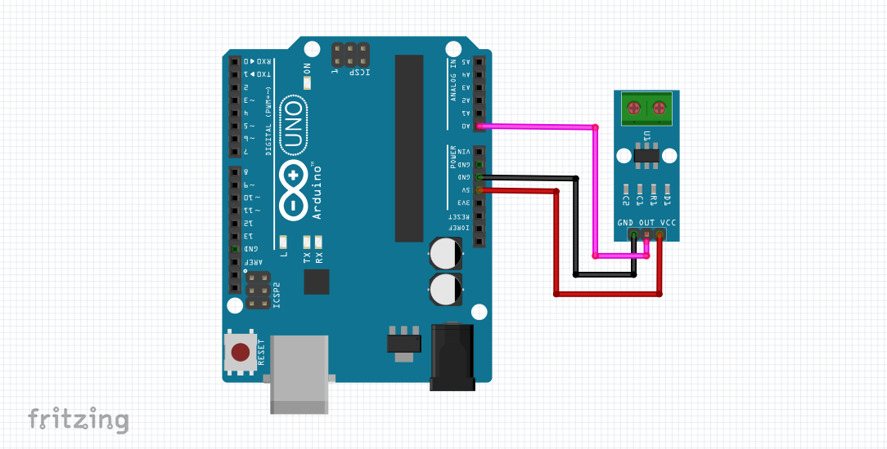
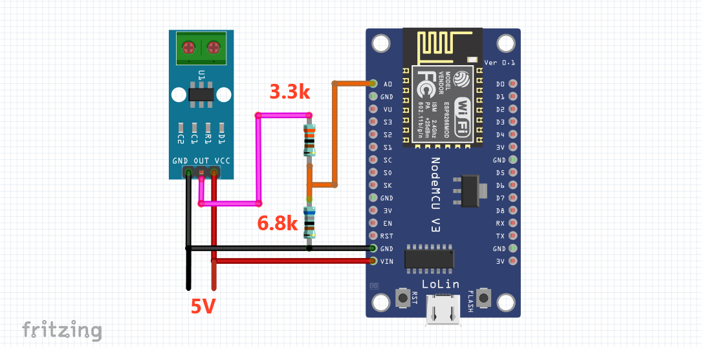

# ACS712 Current Sensor Arduino Library

>This library supports ACS712 current sensor modules of 5A, 20A, and 30A.

The ACS712 current sensor module is a fully integrated, hall-effect-based linear current measuring device. It can measure both AC and DC current. Therefore, this Arduino library helps you to measure both AC (RMS) and DC current. Moreover, there no panic to configure the sensor according to its offset and sensitivity. If facing any problem then, you can change the current configuration to default easily.

#
# Connection Diagram
## ACS712 Module with Arduino
Connect the ACS712 current sensor module according to this diagram. Therefore, must connect the ACS712 current sensor output to an ADC pin of Arduino.

#
## ACS712 Module with NodeMCU / ESP32 / STM32 Blue Pill
Connect the ACS712 current sensor module according to this diagram. Therefore, must connect the ACS712 current sensor output to an ADC pin of NodeMCU / ESP32 / STM32 Blue Pill. Here, we have to care about the voltage levels of NodeMCU / ESP32 / STM32 Blue Pill boards. All these three boards use 3.3V.⚠️The ESP8266 chip (for, example ESP-07, ESP-12E chip, etc.) has an ADC voltage range of 0 to 1V. Consequently, use a voltage divider circuit to meet the ADC range. The following diagram is accurate for those boards that use 3.3V.

#
# Methods

## Constructor
> ### ACS712XX(ACS712XXType _type, uint8_t _pin, uint8_t _adc_ref, int _adc_fs)

This constructor ACS712 has a total of four arguments. Those are Sensor type, Sensor pin, ADC reference voltage, and ADC full-scale output. The default ADC reference voltage is equal to 5V, and the ADC full-scale output is equal to 1023. These values are correct for Arduino. If the target board is NodeMCU / ESP32 / STM32 Blue Pill, then change these values accordingly.

## Member Functions
> ### float getAC(float _freq, float _n_total_period)

This getAC() function measures the AC Root Mean Square (RMS) current and returns AC (RMS) current in ampere. This function has two arguments. Those are the frequency and the number of the measurement period. Here, the default frequency is equal to 50 Hz, and the measurement period is equal to one period. This function operates with a frequency around 1 to 200 Hz, and it can analyze around 0.5 to 20 (at 50 Hz) AC cycles. If you want fast measurement, then set the period is equal to 0.5. Now, it only computes half a period of AC signal that reduces measurement time. For a 50Hz signal, you need only 10ms. But AC mains supply does not perfectly maintain its frequency 50 or 60 Hz, then using only one period of AC signal may not measure accurate RMS current. Then analyze at least two or more AC cycles by choosing the measurement period two or more.

> ### float getDC(int _count)

This getDC() function measures the DC current and returns DC current in ampere. This function has one argument. That is the number of samples taken during computation. By default, this getDC() function returns the current measurement value just, averaging 10 data points.  You can choose any positive value (without zero) then the getDC(number) function returns the current measurement value by averaging the given number of the data point.

> ### float autoCalibrate()

This autoCalibrate() function calibrates the ACS712 sensor by computing the mid-value of the sensor output. And also return that calibrated offset value. Use this function when no current passes through the sensor. First, calibrate this sensor and take that offset value, then manually import that value by using the setOffset() function. These offset values may get changed if the source voltage gets exchanged.

> ### void setOffset(float _offset)

This setOffset() function sets the mid-value of the sensor or the offset.

> ### float getOffset()

This getOffset() function returns the offset value of the sensor.

> ### void setSensitivity(float _sen)

This setSensitivity() function sets the sensitivity of the sensor.⚠️Don't change the default sensitivity. The sensitivity is predefined according to the datasheet of the ACS712. But sometimes, it may get slightly changed. Then use this function to set the new sensitivity of the sensor.

> ### float getSensitivity()

This getSensitivity() function returns the sensitivity value of the sensor.

> ### void reset();

This reset() function reset the sensitivity and offset values of the sensor to default.

#
# Library Examples

> ### ACS712-AC-Test

This example describes the user guide to use this library to measure AC current. It also demonstrates the use of this getAC() function and other methods in a better way. Also, measure different sensor data and inspect those data using the Serial Monitor. This library will help you to make your project remarkable.💌

> ### ACS712-DC-Test

This example describes the user guide to use this library to measure DC current. It also demonstrates the use of this getDC() function and other methods in a better way. Also, measure different sensor data and inspect those data using the Serial Monitor. This library will help you to make your project remarkable.💌
